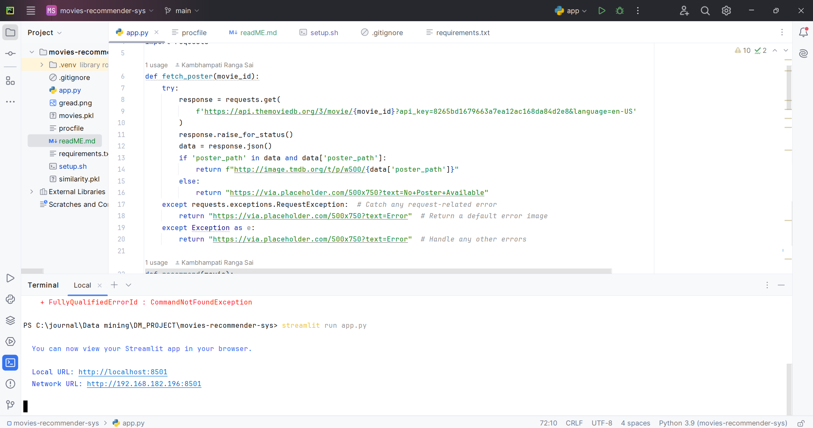
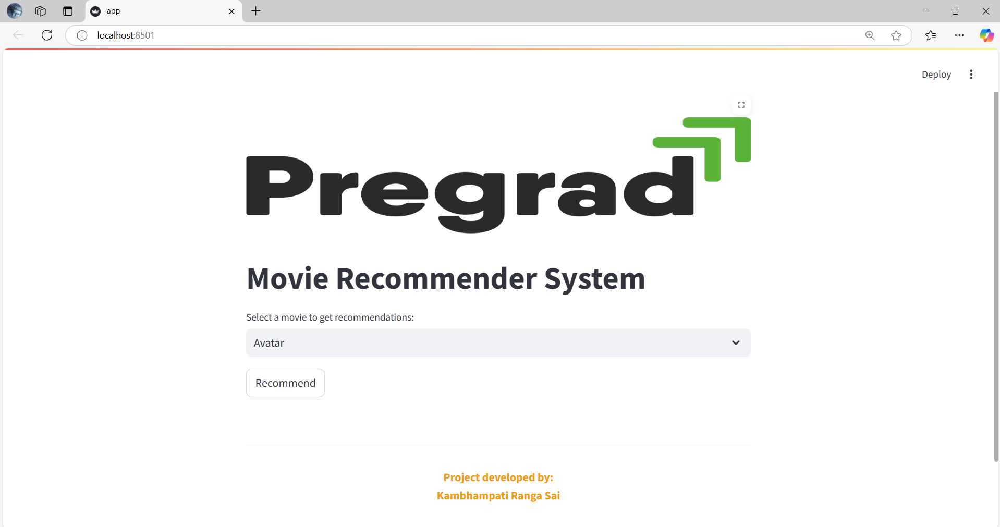
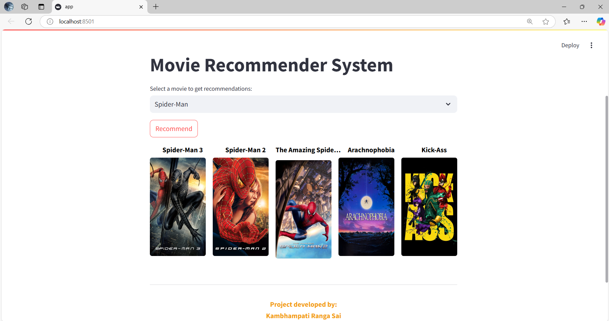

# DATA SETS
https://www.kaggle.com/datasets/tmdb/tmdb-movie-metadata

# DATA CLEANING
https://drive.google.com/file/d/1CUeNcuxrYlSjVtK9B3hm7wTX9_RB6koz/view?usp=sharing

after cleaning the data you will get two file 
1. movies.pkl
2. similarity.pkl

# OUTPUTS

